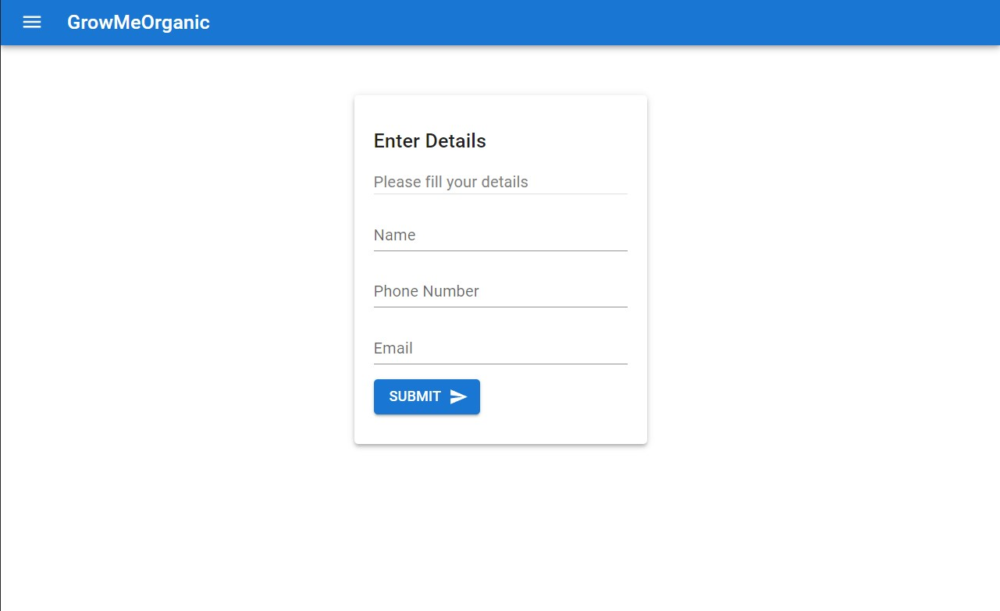
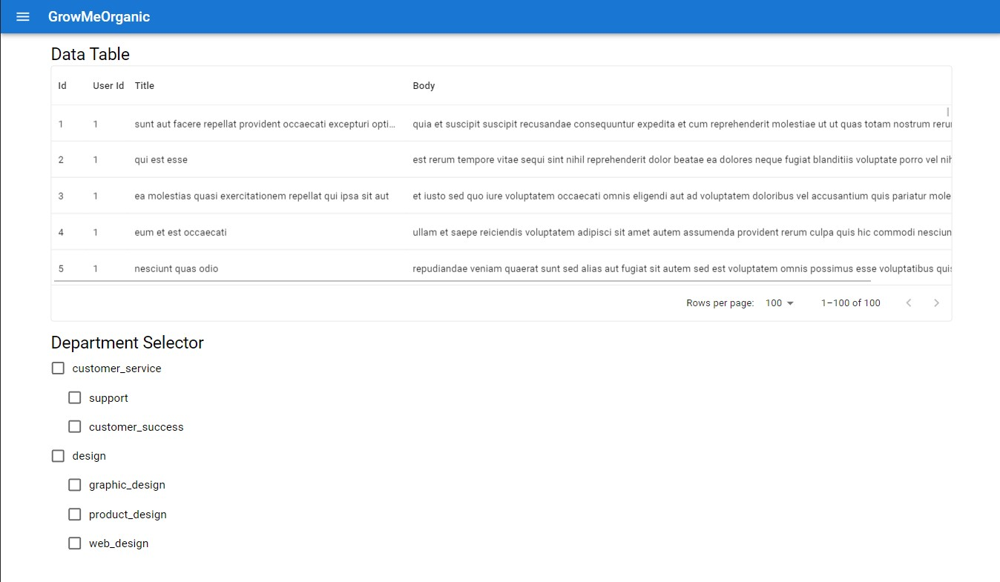

# GrowMeOrganic Internship Project

## 🔗 Deployed Link

### [Live Link](https://growmeorganic-internship-task.netlify.app/ "Live")

## 📷 Sreenshots

## 👨🏻‍💻 Tech Used

### Frontend

### Tools

### Hosting

